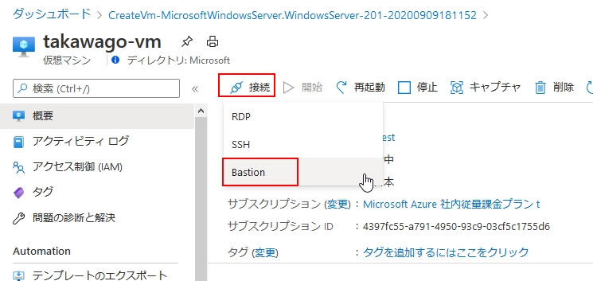

# Azure Bastion ハンズオン 2020年9月10日
## Azure Bastion とは

Azure Bastion サービスは、お使いの仮想ネットワーク内でプロビジョニングする、新しいフル プラットフォームマネージド PaaS サービスです。 これは、Azure portal 内で直接 TLS を経由して、お使いの仮想マシンへの安全かつシームレスな RDP または SSH 接続を提供します。 Azure Bastion 経由で接続する場合、ご自分の仮想マシンにパブリック IP アドレスは必要ありません。

Bastion は、プロビジョニングされる仮想ネットワーク内のすべての VM に対して安全な RDP および SSH 接続を提供します。 Azure Bastion を使用すると、RDP または SSH を使用した安全なアクセスを提供しながら、お使いの仮想マシンが RDP または SSH ポートを外部に公開しないように保護されます。 Azure Bastion を使用して、Azure portal から直接仮想マシンに接続します。 追加のクライアント、エージェント、ソフトウェアは必要ありません。

## アーキテクチャー

Azure Bastion デプロイは、サブスクリプションやアカウント、仮想マシン単位ではなく、仮想ネットワーク単位です。 この仮想ネットワーク内で Azure Bastion サービスをプロビジョニングすると、同じ仮想ネットワーク内のすべての VM で RDP または SSH エクスペリエンスを利用できるようになります。

RDP および SSH は、Azure で実行されているワークロードに接続できる、基本的な手段の一部です。 インターネット経由で RDP または SSH ポートを公開することは望ましくなく、重大な脅威にさらされる面と見なされます。 これは、プロトコルの脆弱性が原因であることがよくあります。 この脅威にさらされる面を含めるには、境界ネットワークの公開される側に踏み台ホスト (ジャンプサーバーとも呼ばれます) をデプロイできます。 Bastion のホスト サーバーは、攻撃に耐えられるように設計および構成されています。 また、Bastion のサーバーは、踏み台の背後やネットワーク内の奥の方にあるワークロードに対する RDP および SSH 接続も提供しています。

この図は、Azure Bastion のデプロイのアーキテクチャを示しています。 この図の内容は次のとおりです。

- Azure Bastion ホストは仮想ネットワーク内にデプロイされています。
- ユーザーは任意の HTML5 ブラウザーを使用して Azure portal に接続します。
- ユーザーは、接続先の仮想マシンを選択します。
- 1 回クリックすると、ブラウザーで RDP または SSH セッションが開きます。
- Azure VM ではパブリック IP が必要ありません。
 

# プライベート IP アドレスと Azure Bastion を使用して仮想マシンに接続する

このハンズオンでは、プライベート IP アドレスを使用して仮想マシンに接続する方法について説明します。 Bastion 経由で接続する場合、仮想マシンにパブリック IP アドレスは必要ありません。 この記事の手順は、ポータルで仮想マシンを使用して仮想ネットワークに Bastion をデプロイする際に役立ちます。 サービスがプロビジョニングされると、同じ仮想ネットワーク内のすべての仮想マシンで RDP/SSH エクスペリエンスを使用できるようになります。

## 前提条件
- Azure 仮想ネットワーク。
- ポート 3389 が開いている仮想ネットワークに配置されている Azure 仮想マシン。

### 値の例

|名前 |	Value|
|---|---|
|リージョン |	東日本|
|仮想ネットワーク名 |	myVirtualNetwork|
|+ サブネット名 |	AzureBastionSubnet|
|AzureBastionSubnet アドレス |	10.1.254.0/27|
|パブリック IP アドレス |	新規作成|
|パブリック IP アドレス名 |	myVirtualNetwork-ip|
|パブリック IP アドレスの SKU |	Standard|
|割り当て |	静的|

## Bastion ホストの作成

既存の仮想マシンを使用してポータルで要塞ホストを作成する場合、お使いの仮想マシンまたは仮想ネットワークに対応する既定値がさまざまな設定に自動的に設定されます。

1. Azure Portalを開きます。 お使いの仮想マシンに移動し、 [接続] をクリックします。
   
2. ドロップダウンから [Bastion] を選択します。
3. [接続] ページで、 [Bastion を使用] を選択します。
   

4. [Bastion] ページで、次の設定フィールドを入力します。
   - 名前:Bastionホストに名前を付ける
   - サブネット:Bastion リソースがデプロイされる仮想ネットワーク内のサブネットです。 このサブネットは AzureBastionSubnet という名前で作成される必要があります。 この名前により、Bastion リソースをデプロイするサブネットが Azure で認識されます。 これはゲートウェイ サブネットとは異なります。 /27 かそれより大きいサブネットを使用する必要があります (/27、/26、/25 など)。
     - [サブネット構成の管理] を選択し、 [+ サブネット] を選択します。
     
     - [サブネットの追加] ページで、「AzureBastionSubnet」と入力します。
     - アドレス範囲を CIDR 表記で指定します。 (例: 10.1.1.0/27)。
     - [OK] を選択してサブネットを作成します。 ページの上部で、Bastion に戻って残りの設定を完了します。
     
     - [パブリック IP アドレス] : これは、RDP/SSH が (ポート 443 経由で) アクセスされる Bastion リソースのパブリック IP です。 新しいパブリック IP を作成するか、既存のものを使用します。 パブリック IP アドレスは、作成している Bastion リソースと同じリージョン内にある必要があります。
     - パブリック IP アドレス名:パブリック IP アドレス リソースの名前です。
5. 検証画面で、 [作成] をクリックします。 Bastion リソースが作成され、デプロイされるまで、約 5 分お待ちください。

## 接続
Bastion が仮想ネットワークにデプロイされると、画面が [接続] ページに変わります。
1. 仮想マシン用のユーザー名とパスワードを入力します。 次に、 [接続] を選択します。

2. Bastion を使用したこの仮想マシンへの RDP 接続は、ポート 443 と Bastion サービスを使用して (HTML5 を介して) Azure portal で直接開きます。

# まとめ

このハンズオンでは、仮想ネットワーク用の Bastion ホストを作成し、その Bastion ホストを介して安全に仮想マシンに接続できることを確認しました。
