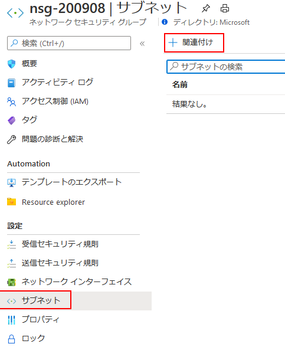
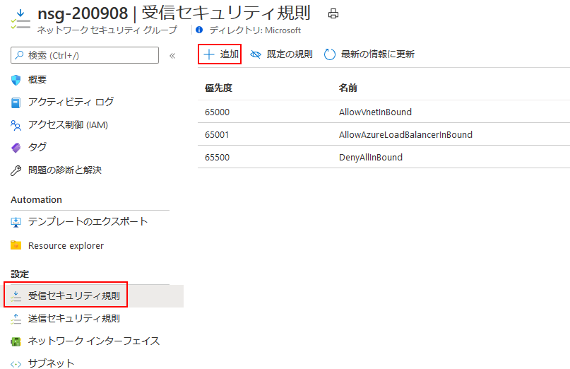
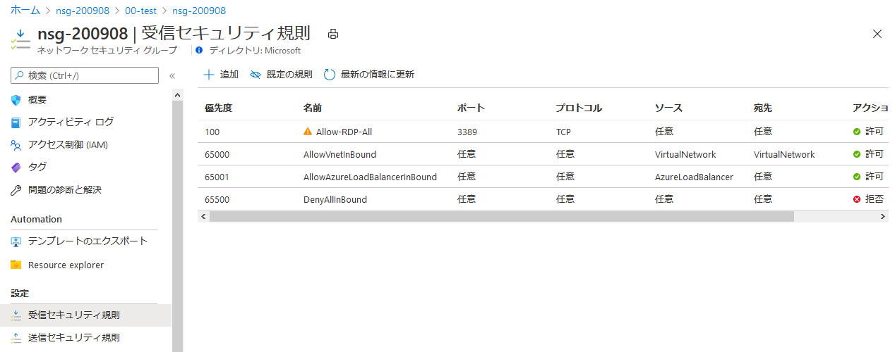

# 小林製薬株式会社 御中   仮想ネットワークと仮想マシンの作成 ハンズオン 2020年9月10日
# ハンズオン: ネットワーク セキュリティ グループの作成
1. Azure portal メニュー上または [ホーム] ページから [リソースの作成] を選択します。
2. [ネットワーク] で検索、 [ネットワーク セキュリティ グループ] を選び、[作成] を選択します。
3. 以下の情報を入力するか選んだ後、 [確認および作成] を選びます。
    |設定 |	Value|
    |---|---|
    |名前 |	myNsg|
    |サブスクリプション |	サブスクリプションを選択します。|
    |Resource group |	[既存のものを使用] 、 [myResourceGroup] の順に選択します。|
    |場所 |	米国東部|
4. [作成] を選択します。

## ネットワーク セキュリティ グループをサブネットに関連付ける
1. ポータルの上部にある [リソース、サービス、ドキュメントの検索] ボックスで、「myNsg」と入力します。 検索結果に myNsg が表示されたら、それを選択します。
2. 次の図に示すように、 [設定] で [サブネット] を選択し、 [+ 関連付け] を選択します。

    

3. [サブネットの関連付け] で [仮想ネットワーク] を選択し、 [myVirtualNetwork] を選択します。 [サブネット] を選択し、 [mySubnet] を選択して [OK] を選択します。

## セキュリティ規則を作成する

1. 次の図に示すように、 [設定] で [受信セキュリティ規則] を選択し、 [+ 追加] を選択します。

2. 次の値を指定します。

|設定 |	Value|
|---|---|
|宛先ポート範囲 |	「3389」と入力|
|プロトコル |	[TCP] を選択|
|優先度 	|「110」と入力|
|名前 |	Allow-RDP-All|

このハンズオンでは、VM 用に、RDP (ポート 3389) がインターネットに公開されています。 運用環境では、ポート 3389 をインターネットに公開せずに、VPN またはプライベート ネットワーク接続を使用して、管理する Azure リソースに接続することをお勧めします。

手順 1 から 2 を完了したら、作成した規則を確認します。 一覧は、次の図のように表示されます。
    

