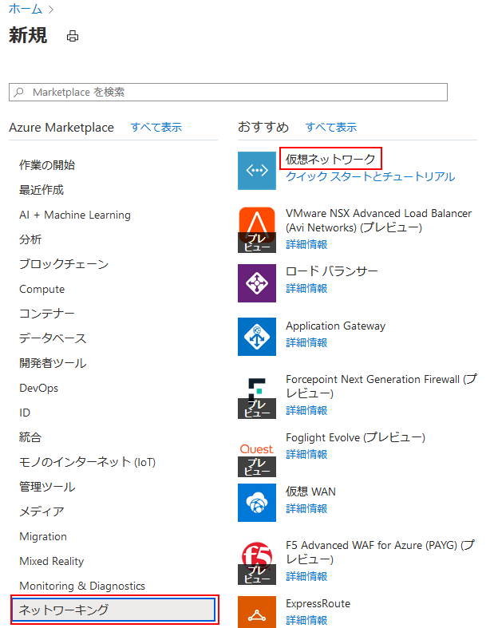
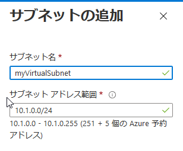
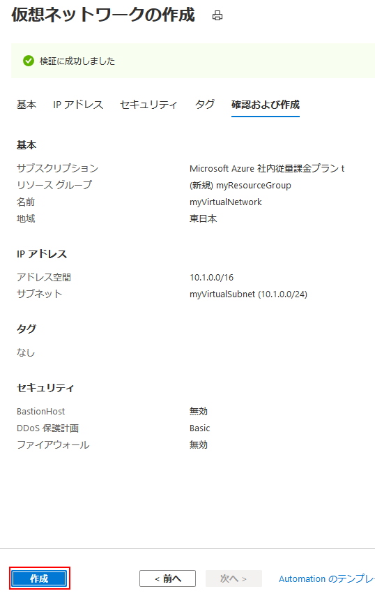

# 仮想ネットワークと仮想マシンの作成 ハンズオン 2020年9月10日
## 

本日のハンズオンで使用するパラメータ
|サブスクリプション|利用するサブスクリプション|
|--|--|
|Resource Group|myResourceGroup (サブスクリプションで唯一の名前)|
|仮想ネットワーク名|myVirtualNetwork|
|リージョン|東日本|
|IPv4 アドレス空間|172.16.0.0/16|
|サブネット名|myVirtualSubnet|
|サブネットのアドレス範囲|172.16.0.0/24|
|仮想マシン名|myVm1 (サブスクリプションで唯一の名前)|
|仮想マシン パブリックIP名 |myVm-ip|
|ストレージアカウント名|mystorageaccount (グローバルで唯一の名前)|
|Bastionサブネット名|AzureBastionSubnet|
|Bastionサブネットのアドレス範囲 |	172.16.1.0/27|
 

## ハンズオン: 仮想ネットワークの作成

1. Azure portal メニューから [リソースの作成] を選択します。 Azure Marketplace で、 [ネットワーキング] > [仮想ネットワーク] を選択します。
   
    
2. [仮想ネットワークの作成] に次の情報を入力または選択します。

    |設定 |	値|
    |---|---|
    |サブスクリプション |	利用するサブスクリプションを選択します。|
    |Resource group |	[新規作成] を選択し、「myResourceGroup」と入力して、 [OK] を選択します。|
    |名前 |	「myVirtualNetwork」と入力します。|
    |場所 |	[東日本] を選択します。|
3. 次へ:[Next: IP Addresses](次へ: IP アドレス) を選択し、 [IPv4 アドレス空間] に「10.1.0.0/16」と入力します。
4. [サブネットの追加] を選択し、 [サブネット名] に「myVirtualSubnet」、 [サブネットのアドレス範囲] に「10.1.0.0/24」と入力します。
   
   
5. [追加] を選択し、 [確認および作成] を選択します。 残りは既定値のままにして、 [作成] を選択します。
6. [仮想ネットワークの作成] で、 [作成] を選択します。
   

## 仮想マシンを作成する
仮想ネットワークに VM を作成します。

### VM を作成する
1. Azure portal メニューから [リソースの作成] を選択します。
2. [Windows Server 2016 Datacenter] を選択します。
3. [仮想マシンの作成 - 基本] に次の情報を入力または選択します。
    |設定 |	値|
    |---|---|
    |プロジェクトの詳細| 	|
    |サブスクリプション |	サブスクリプションを選択します。|
    Resource group |	[myResourceGroup] を選択します。リソースグループがない場合新規に作成します。|
    |**インスタンスの詳細**|	
    |仮想マシン名 |	「myVm1」と入力します。|
    |リージョン |	[東日本] を選択します。|
    |可用性のオプション |	既定値の [インフラストラクチャ冗長は必要ありません] になります。|
    |Image |	既定値の [Windows Server 2016 Datacenter] になります。|
    |サイズ |	既定値の [Standard_B2ms] になります。|
    |**管理者アカウント**|	
    |ユーザー名 |	任意のユーザー名を入力します。|
    |Password |	任意のパスワードを入力します。 パスワードは 12 文字以上で、定義された複雑さの要件を満たす必要があります。( Password.1!! など) |
    |パスワードの確認 |	パスワードを再入力します。|
    |**受信ポートの規則**|
    |パブリック受信ポート |	[選択したポートを許可する] を選択します。|
    |受信ポートの選択 |	RDP (3389) 」を選択します。|
    |**コスト削減**|
    |Windows ライセンスを既にお持ちの場合 |	既定値の [いいえ] になります。|

4. 次へ:ディスク を選択します。
5. [仮想マシンの作成 - Disk] で、既定値のままにして、 [次: ネットワーク>] を選択します。
6. [仮想マシンの作成 - ネットワーク] で次の情報を選択します。
    |設定 |	値|
    |---|---|
    |仮想ネットワーク |	既定値の [myVirtualNetwork] になります。|
    |Subnet |	既定値の [myVirtualSubnet (10.1.0.0/24)] になります。|
    |パブリック IP |	既定値の [(new) myVm-ip] になります。|
    |NIC ネットワーク セキュリティ グループ |	既定値の [Basic] になります。|
    |パブリック受信ポート |	既定値の [選択したポートを許可する] になります。|
    |受信ポートの選択 |	既定値の [RDP] になります。|

7. 次へ:管理 を選択します。
8. [仮想マシンの作成 - 管理] の [OSのゲスト診断] の [オン] を選択し、 [新規作成] を選択します。
9.  [ストレージ アカウントの作成] に次の情報を入力または選択します。
    |設定|値|
    |---|---|
    |名前 	|「myvmstorageaccount」と入力します。 (この名前は グローバルで一意である必要があります。)|
    |アカウントの種類 |	既定値の [Azure Storage General Purpose v1] になります。|
    |パフォーマンス |	既定値の [Standard] になります。|
    |レプリケーション |	既定値の [ローカル冗長ストレージ (LRS)] になります。|

10. [OK] を選択し、 [確認および作成] を選択します。 [確認および作成] ページが表示され、Azure によって構成が検証されます。
11. "検証に成功しました" というメッセージが表示されたら、 [作成] を選択します。
